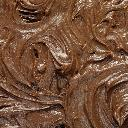
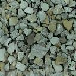
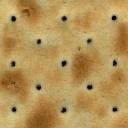
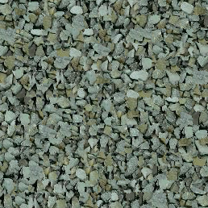

# Image quilting for texture synthesis and transfer

This repository implements image quilting for texture synthesis and transfer using CPP.

## Reference:

1. Alexei A. Efros and William T. Freeman. 2001. Image quilting for texture synthesis and transfer. In Proceedings of the 28th annual conference on Computer graphics and interactive techniques (SIGGRAPH '01). Association for Computing Machinery, New York, NY, USA, 341–346. https://doi.org/10.1145/383259.383296

2. https://github.com/rohitrango/Image-Quilting-for-Texture-Synthesis

(The above Python implementation takes several minutes to process. Current CPP implementation takes just a few seconds.)

## Development Environment

MacOS 10.15

## How to run:

```
make all
make run [ARGS="[-i input_path] [-o output_path] [-p patch_size] [-v overlap_ratio] [-s scale] [-t tolerance] [-n n_iter]"]
```

First, `make all` to build.

`[ ]` means optional; you can run through `make run,` `make run ARGS="-p 20"`, `make run ARGS="-p 20 -s 5"`. Any of them is runnable.

## Argument for Executable:

- `-i` for input image path.
- `-o` for output image path.

## Simple Example:

Input image:

  

Output synthesized image:

  

## Note

The effect may vary according to the definition of patch size, error tolerance, and max iteration. I haven't tested the proper parameters for each case. You could try on different parameters for better results.

For example, you may need a bigger patch size for the complicated texture.
