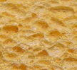
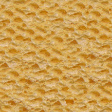

# Image quilting for texture synthesis and transfer

This repository is an implementation of the image quilting for texture synthesis and transfer using Cpp.

## Reference:

1. Alexei A. Efros and William T. Freeman. 2001. Image quilting for texture synthesis and transfer. In Proceedings of the 28th annual conference on Computer graphics and interactive techniques (SIGGRAPH '01). Association for Computing Machinery, New York, NY, USA, 341–346. https://doi.org/10.1145/383259.383296

2. https://github.com/rohitrango/Image-Quilting-for-Texture-Synthesis

## How to run:

```
make all
make run
```

## Argument for Executable:

- `-i` for input image path.
- `-o` for output image path.

## Simple Example:

Input image:



Output synthesized image:


